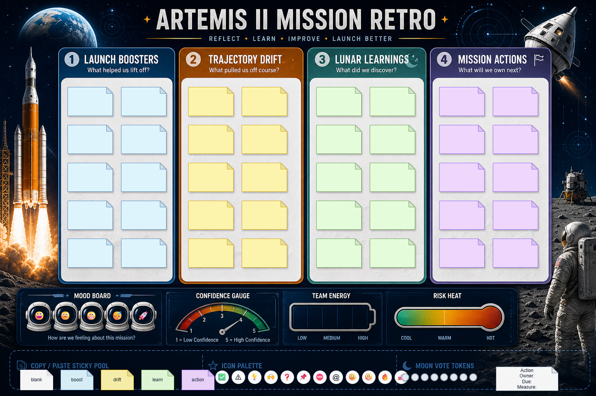
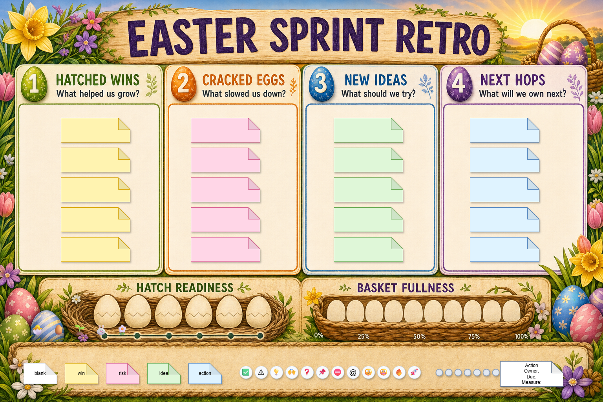
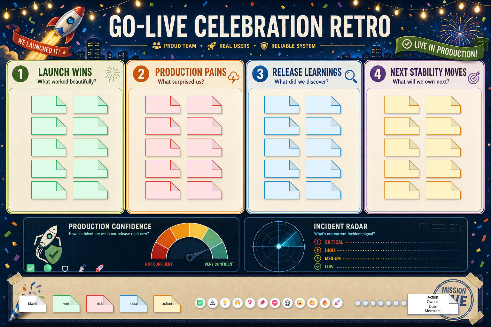
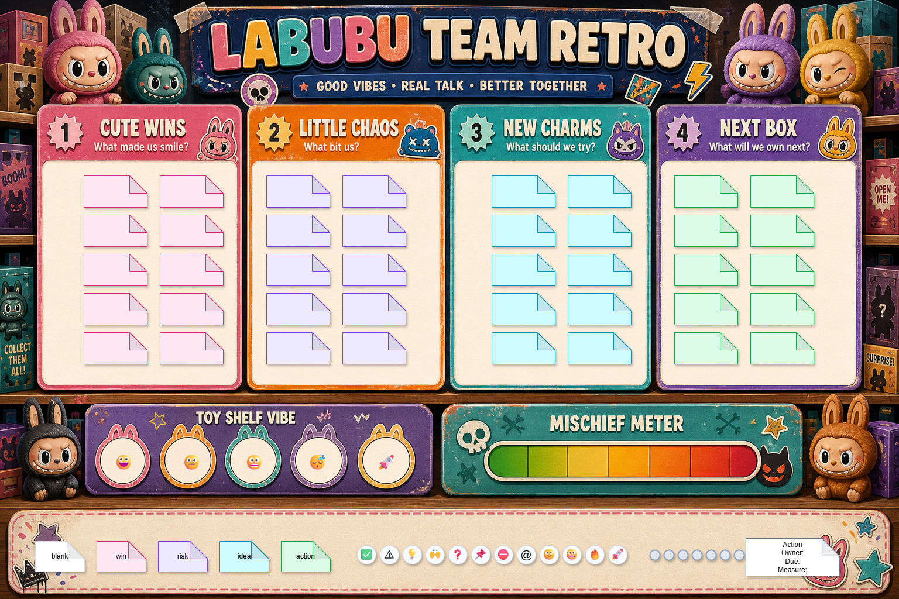
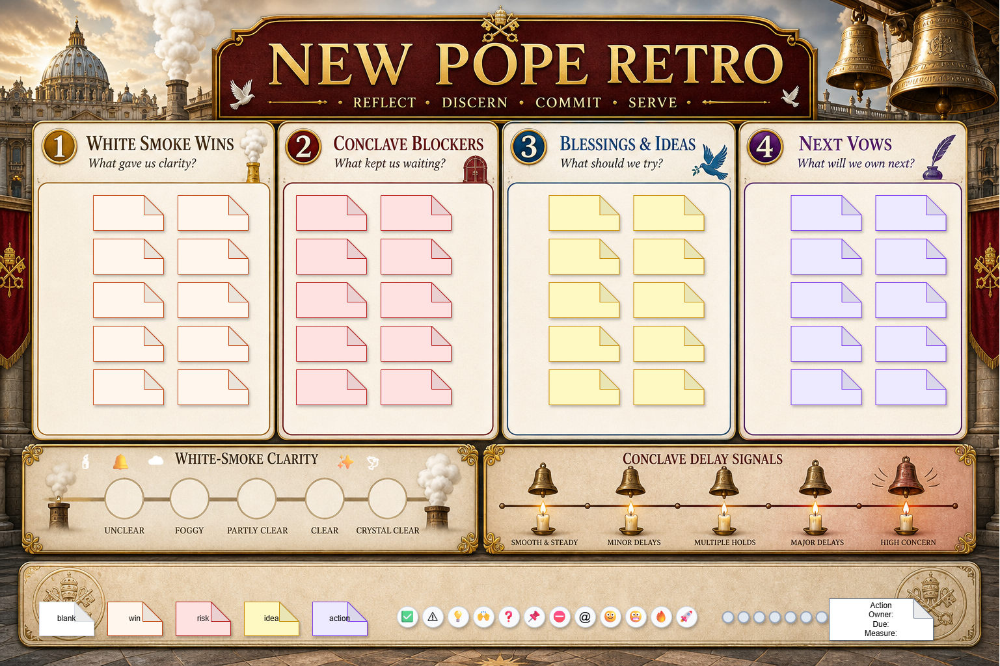
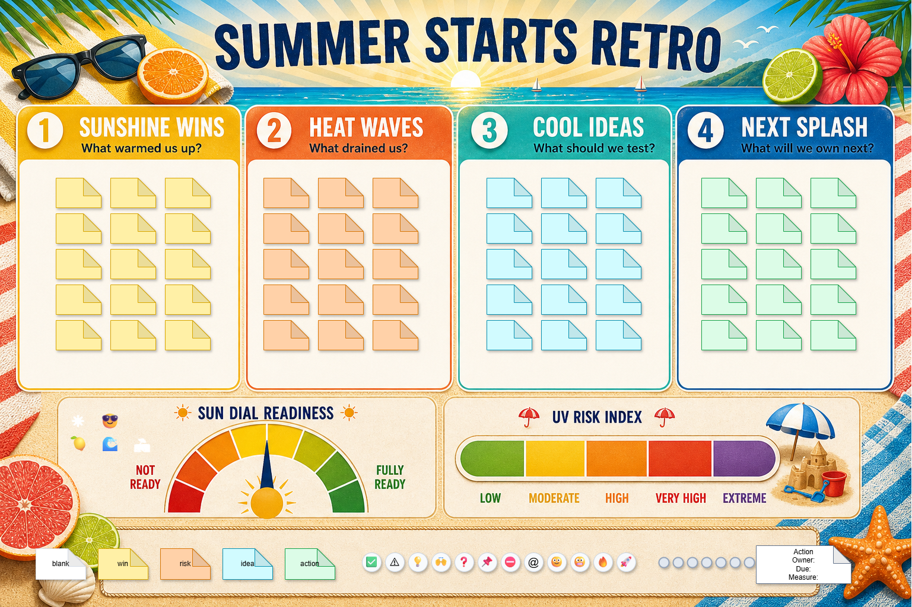

# Retro Board Creator

[](https://github.com/jovd83/retro-board-creator/actions/workflows/ci.yml)
[](SKILL.md)
[](LICENSE)
[](https://buymeacoffee.com/jovd83)

`retro-board-creator` is an Agent Skill for designing visually engaging agile / scrum **retrospective boards** and for **interpreting completed retros** into summaries, action items, and ticket-ready follow-ups.

It is designed for agents that need to:

- create a new retro board in Draw.io, Mermaid, PNG/SVG, Microsoft Whiteboard guidance, or plain text
- author hybrid Draw.io boards with generated background art and editable sticky-note overlays
- interpret a finished board (photo, screenshot, export, XML, or transcript) into a structured summary
- produce Confluence-ready notes, Jira issue drafts, and team follow-up messages
- size columns so each active section can hold real team output, not just decorative placeholders

The repository is intentionally small and opinionated. It is easy to install, easy to maintain, and strict about facilitation quality.

## Quick Start

Explicit invocation:

```text
Use $retro-board-creator to make a Draw.io board for our sprint review. I feel lucky.
```

Typical requests that should trigger this skill:

- "Make a fun Draw.io retro board for our sprint review."
- "Create a serious Mermaid post-mortem board for tomorrow's incident retro."
- "Generate a hybrid retro with a themed background and editable sticky notes."
- "Summarize this retro photo into Confluence notes and Jira drafts."
- "Turn this Draw.io export into action items with owners and due dates."

Requests that are out of scope:

- "Schedule the retro meeting in Outlook." → calendar tool
- "Push these action items into our real Jira project." → use a Jira connector
- "Generate a logo / brand identity." → general image-generation tools

## What The Skill Is Responsible For

- Choosing a retro structure (sections, diagnostics, copy/paste pools) that matches the session goal.
- Producing editable, well-formed Draw.io and Mermaid output.
- Generating hybrid boards where background art and editable overlays follow the same layout contract.
- Interpreting completed boards into themes, signals, decisions, and accountable action items.
- Producing Confluence and Jira-ready text without claiming a live integration that did not happen.

## What The Skill Is Not Responsible For

- Pushing tickets to Jira, Confluence, or Microsoft Whiteboard via live APIs.
- Scheduling, inviting, or running the retrospective meeting itself.
- Long-lived shared memory across teams or projects.
- General-purpose image generation outside the retro-board context.

## Who This Is For

- Scrum masters, agile coaches, and team leads who run retros regularly
- AI engineers and agent builders who want a reliable retro authoring + interpretation skill
- Distributed teams that need quick, themed boards without spinning up a SaaS tool

## Skill Contract

At runtime, the skill should:

1. classify the request as **board creation**, **post-retro interpretation**, or **both**
2. intake context: team, sprint, mode (remote / in-person / hybrid), audience size
3. confirm output format and visual mode (`editable vector`, `generated raster`, or `hybrid`)
4. choose sections, diagnostics, and a copy/paste pool sized for the team
5. produce the requested artifact and validate it against the quality checklist

The full contract lives in [SKILL.md](./SKILL.md). Pattern guidance lives in [references/board-patterns.md](./references/board-patterns.md), output recipes in [references/output-recipes.md](./references/output-recipes.md), and post-retro guidance in [references/post-retro-summary.md](./references/post-retro-summary.md).

## Output Modes

The skill supports several output modes:

- `drawio` editable vector boards (with optional generated background)
- `mermaid` board maps and incident-retro flowcharts
- `png` / `svg` raster or vector boards for showcase use
- `microsoft-whiteboard` setup guidance and section layout
- `text` summaries, Confluence-ready notes, and Jira issue drafts

## Installation

If you publish this repository, install it by repository URL:

```bash
npx skills add <git-url> --skill retro-board-creator
```

For local development, place the folder in a skills directory supported by your agent client, such as:

- `~/.agents/skills/retro-board-creator`
- `<project>/.agents/skills/retro-board-creator`

## Repository Layout

```text
agents/
  openai.yaml              Client-facing UI metadata
evals/
  evals.json               Output-quality regression prompts and assertions
examples/
  README.md                Curated example inventory
  *.drawio.png             Rendered hybrid Draw.io retro examples
references/
  board-patterns.md        Section, theme, and anti-pattern guidance
  output-recipes.md        Format-specific recipes (Draw.io, Mermaid, PNG, ...)
  post-retro-summary.md    Interpretation, clustering, and follow-up guidance
scripts/
  generate_drawio_retro.py CLI helper that emits a starter .drawio board
SKILL.md                   Skill definition and runtime instructions
```

## Examples

The [examples/](./examples/) folder contains rendered hybrid Draw.io boards generated with this skill. Each one combines a generated raster background with editable sticky-note overlays.

<table>
  <tr>
    <td align="center">
      <a href="./examples/artemis-ii-generated-background-retro.drawio.png">
        
      </a><br/>
      <sub><b>Artemis II launch</b></sub>
    </td>
    <td align="center">
      <a href="./examples/easter-generated-background-retro.drawio.png">
        
      </a><br/>
      <sub><b>Easter</b></sub>
    </td>
    <td align="center">
      <a href="./examples/go-live-celebration-generated-background-retro.drawio.png">
        
      </a><br/>
      <sub><b>Go-live celebration</b></sub>
    </td>
  </tr>
  <tr>
    <td align="center">
      <a href="./examples/labubu-generated-background-retro.drawio.png">
        
      </a><br/>
      <sub><b>Labubu</b></sub>
    </td>
    <td align="center">
      <a href="./examples/new-pope-generated-background-retro.drawio.png">
        
      </a><br/>
      <sub><b>New pope</b></sub>
    </td>
    <td align="center">
      <a href="./examples/summer-starts-generated-background-retro.drawio.png">
        
      </a><br/>
      <sub><b>Summer starts</b></sub>
    </td>
  </tr>
</table>

Click any thumbnail to open the full-resolution PNG. See [examples/README.md](./examples/README.md) for the prompt patterns used to produce them.

## Generating a Starter Board

The repo ships a small CLI helper for the Draw.io path:

```bash
python scripts/generate_drawio_retro.py \
  --title "Sprint Retro" \
  --theme "Space Mission" \
  --columns "Went Well|Did Not Go Well|Ideas|Action Items" \
  --output retro.drawio
```

Open the resulting `.drawio` file in [diagrams.net](https://app.diagrams.net) or the Draw.io desktop app.

## Validation

This repository ships an evals-driven regression surface:

- [evals/evals.json](./evals/evals.json): prompt + assertion pairs covering the main board-creation and interpretation paths
- GitHub Actions workflow at [.github/workflows/ci.yml](./.github/workflows/ci.yml) that validates `SKILL.md` frontmatter, evals JSON shape, and Python script syntax on every push and PR

Run the basic structural checks locally:

```bash
python -c "import json; json.load(open('evals/evals.json'))"
python -m py_compile scripts/generate_drawio_retro.py
```

## Evaluation Strategy

The recommended maintainer loop:

1. update `SKILL.md` and references for any new behavior
2. add or refine prompts in `evals/evals.json`
3. run the evals via your harness of choice (the workspace at `retro-board-creator-workspace/iteration-N/` is the local convention)
4. compare `with_skill` vs. `without_skill` outputs and grade them
5. tighten the skill or examples if the output drifts
6. commit and push so CI re-validates

## Memory Boundary

This skill keeps memory responsibilities explicit:

- runtime memory is ephemeral and scoped to the current retro
- project / skill memory is only used when the user asks to persist board files or notes
- shared memory across teams is out of scope for this skill

## Maintainer Workflow

When updating the skill:

1. edit `SKILL.md` first
2. update references if a workflow, anti-pattern, or recipe changed
3. refresh examples or eval fixtures if the skill learned a new pattern
4. validate evals JSON and script syntax
5. push and let CI confirm the validation passes
