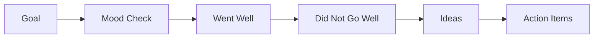

# Output Recipes

## Visual Mode Selection

Ask the user which visual mode they want when it is not already clear:

1. `Editable vector`: best for Draw.io, Mermaid, SVG, diagrams.net, and whiteboard layouts that must be edited later.
2. `Generated real/raster images`: best for polished PNG/JPG boards, visual inspiration, moodboards, and immersive themes.
3. `Hybrid`: best default for high-quality retro boards. Generate or source rich visual direction, then create an editable board with large sticky-note areas, widgets, and copy/paste pools.

If the user says `I feel lucky`, choose `hybrid` unless the requested output format forces another mode.

## Mermaid

Use Mermaid when the user needs a lightweight diagram in Markdown, documentation, or chat.

Rules:

1. Represent the board as a flowchart or mind map.
2. Keep labels short.
3. Put detailed instructions outside the Mermaid block.
4. Do not pretend Mermaid is an editable sticky-note board.
5. Add an action-item table after the diagram when needed.

Example:



## Draw.io

Use Draw.io when the user needs an editable board.

Rules:

1. Ask how many post-its should fit per column unless the user already gave a number or delegated the choice.
2. Create `.drawio` XML with root cells `id="0"` and `id="1"`.
3. Use columns or swimlanes for retro sections.
4. Add sticky notes as Draw.io `shape=note` objects, not baked background pixels.
5. Add enough sticky-note objects per column to match the requested capacity.
6. Add a copy/paste pool on the side or bottom.
7. Add colored dots for voting.
8. Add owner and due-date fields in action-item cards.
9. Use XML entities for special characters.
10. Keep coordinates on a 10px grid.
11. Prefer the bundled script for standard boards:

   ```bash
   python scripts/generate_drawio_retro.py --title "Sprint Retro" --theme "Arcade" --columns "High Scores|Bugs|Power-Ups|Next Level" --notes-per-column 10 --output retro.drawio
   ```

12. Export with the local Draw.io skill or CLI when available.
13. For hybrid boards, embed a generated PNG/JPG as a locked full-board background image, then place editable Draw.io sticky notes, tags, and action fields on top.
14. Keep the background image non-movable/non-resizable when possible, so participants edit only the sticky notes and widgets.
15. Create a layout contract before generating the background:
   - page size
   - title band
   - four or more column rectangles
   - column header height
   - note-safe rectangles
   - diagnostics zone
   - copy/paste pool zone
16. Use the same coordinates from the layout contract in the image prompt and in Draw.io object placement.
17. Do not include post-its or icon palettes in the generated background image for Draw.io hybrid boards.
18. Put icon palettes in Draw.io as editable/copyable Unicode, emoji, emoticon markup, or icon text objects; sources like Unicode Explorer can inspire the symbol set.
19. Use real Unicode emoji for mood-board markers, not ASCII-only text such as `:)`, `:/`, or `:D`, unless the user explicitly asks for ASCII emoticons.
20. Do not repeat column titles, section labels, or helper labels as Draw.io text if the background artwork already contains readable text.
21. It is acceptable, and often preferable, to keep non-editable visual widgets in the background when they are theme-native and useful.
22. Do not include mood, confidence, energy, and risk widgets together by default; choose the smallest useful set for the facilitation goal.
23. Rename widgets and draw them as theme-native props: `Launch Readiness`, `UV Index`, `Service Pulse`, `Candle Flame`, `Fuel Cell`, `Mischief Meter`, or similar.
24. Add editable emoji/emoticon markers on top of mood-board slots when participants should move or copy them.
25. Fit post-its fully inside the generated column regions. Shrink the notes or reduce visual padding before allowing overlap outside the column.
26. Use one sticky-note color per column unless the user asks for mixed colors.
27. Ask the image generator to reserve bottom or side space for editable Draw.io overlays when the board needs copy/paste pools or icon palettes.

Alignment rules:

1. Place editable notes only inside note-safe rectangles, never over the title, prompts, diagnostics, or object pool.
2. Use equal left/right padding inside every column.
3. Use equal row gaps and column gaps for every note in a column.
4. Choose note dimensions from the requested capacity:
   - 5 notes: 1 column x 5 rows, large notes
   - 10 notes: 2 columns x 5 rows, medium notes
   - 15 notes: 3 columns x 5 rows, compact notes
5. Keep at least 12px between notes and the column border.
6. Keep at least 18px between notes and the column header or prompt.
7. Keep at least 24px between the last note row and diagnostics or object pools.
8. If the generated background places a decorative object inside the note-safe rectangle, move or shrink the editable notes before delivery.
9. Validate by counting notes per column and checking all note bounding boxes are inside their note-safe rectangles.

Hybrid background prompt pattern:

```text
Create only the board, no host-tool UI. Use a generated raster background with large empty column regions.
Include 1-2 theme-native diagnostic widgets that fit the retro goal, not all generic widgets.
Rename diagnostics to match the theme, for example <theme-specific readiness label> or <theme-specific risk label>.
Use this layout contract: title band at top; columns below with a clear header area and a large blank note-safe rectangle; diagnostics below columns; copy/paste pool at the bottom.
Do not draw sticky notes, icon palettes, vote dots, or copy/paste objects into the background.
Reserve space for editable Draw.io sticky notes and reusable markers.
```

## PNG or SVG

Use PNG/SVG when the user needs a polished visual, printout, or shareable image.

Rules:

1. Ask whether the user wants generated/raster imagery, vector illustration, real web images, or hybrid unless already clear.
2. Use image generation when available for bespoke themed visuals.
3. Use SVG/HTML rendering when deterministic text placement matters.
4. Use real images only when the user asks for them, generated images are unavailable, or a specific real-world subject is required.
5. Check licensing before using web images.
6. Keep text large enough for remote meeting screens.
7. Provide source files when the user may need later edits.
8. Do not render fake menus, app sidebars, browser bars, or toolbar chrome unless the user asks for a screenshot-like mockup.
9. Keep the title and board content as the focus.

## Microsoft Whiteboard

Use Microsoft Whiteboard guidance when the user plans to facilitate in Teams or Whiteboard.

Rules:

1. Do not claim direct creation or import unless a live connector/API is available.
2. Provide a board setup checklist:
   - Create or open a Teams meeting.
   - Open Whiteboard.
   - Choose a retrospective template or blank board.
   - Add the generated section titles.
   - Add sticky-note color legend.
   - Add voting dots or reaction instructions.
   - Share the board link.
3. Include async instructions when requested:
   - due date
   - section instructions
   - sticky-note color legend
   - voting deadline
4. After the session, instruct export to PNG or provide the board link for summarization.

## Text, Confluence, and Jira

Use text formats when the user needs follow-up rather than a visual board.

Confluence-ready structure:

```text
h1. Retrospective Summary
h2. Context
h2. Sentiment
h2. Themes
h2. Decisions
h2. Action Items
h2. Follow-up for Next Retro
```

Jira draft structure:

```text
Title:
Problem:
Action:
Owner:
Due date:
Acceptance criteria:
Source retro theme:
```
